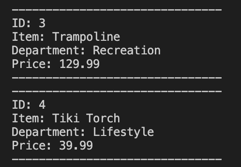
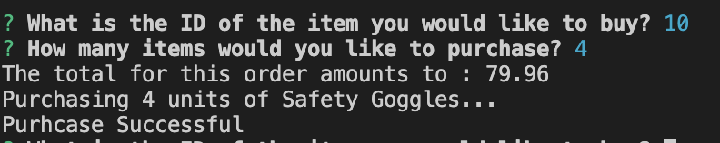
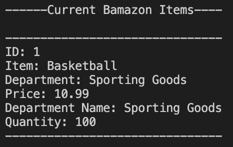
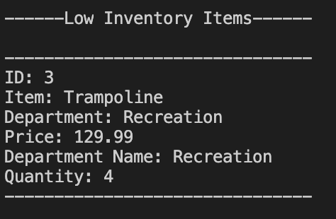
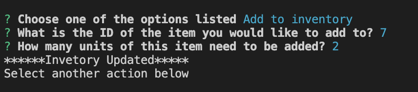
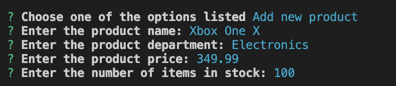

# Bamazon - mysql & node application

##### In this activity, I have created an Amazon-like storefront with the MySQL and Node. The app will take in orders from customers and deplete stock from the store's inventory. Additionally there is a program on the app to track product sales across your store's departments and then provide a summary of the highest-grossing departments in the store.

## Getting Started

* Clone the repository.

* Run command npm install in Terminal.

* Set up MySQL database. If you do not already have MySQL installed, you can visit the installation page to install the correct version of MySQL for your machine. Then, create the Bamazon database used the SQL code in Bamazon.sql.

* Then, type in one of the commands to use the application 

    * node bamazonCustomer.js

        * Running this application will first display all of the items available for sale. Include the ids, names, and prices of products for sale.

         

        * The app should then prompt users with two messages.
            * The first should ask them the ID of the product they would like to buy.
            * The second message should ask how many units of the product they would like to buy.

        * It then calculates the total, then updates the quantity in the mysql database

         

    * node bamazonManager.js

        * If a manager selects View Products for Sale, the app should list every available item: the item IDs, names, prices, and quantities.

        

        * If a manager selects View Low Inventory, then it should list all items with an inventory count lower than five.

        

        * If a manager selects Add to Inventory, your app should display a prompt that will let the manager "add more" of any item currently in the store.

        

        * If a manager selects Add New Product, it should allow the manager to add a completely new product to the store.

        

        

